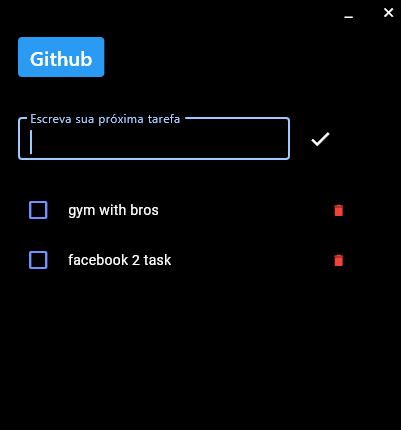
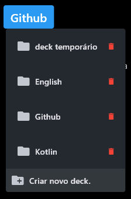
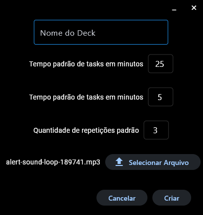

# To-Do List - Só Que Melhor

Este é um projeto de lista de tarefas melhorado, desenvolvido em Python. Siga as instruções abaixo para clonar o repositório, instalar as dependências e compilar o projeto.

## Instruções de Instalação

### Clonando o Repositório

Para clonar este repositório, execute o seguinte comando no seu terminal:

```bash
git clone https://github.com/andradavic/to-do-list-so-que-melhor.git
cd to-do-list-so-que-melhor
```

### Instalando as Dependências

Certifique-se de ter o Python e o `pip` instalados. Em seguida, instale as dependências necessárias executando:

```bash
pip install -r requirements.txt
```

### Compilando com PyInstaller

Para compilar o projeto usando o PyInstaller e esconder o console, execute o comando abaixo:

```bash
pyinstaller --distpath dist --onefile --windowed .\main.py
```

O arquivo `.exe` gerado estará na pasta `dist`.

### Estrutura de Pastas

Para que o executável funcione corretamente, é necessário que as pastas `database` e `assets` estejam no mesmo diretório do executável gerado. Siga os passos abaixo:

1. Navegue até a pasta `dist` onde o arquivo `.exe` foi gerado.
2. Copie o arquivo `.exe` para o diretório onde deseja executá-lo.
3. Certifique-se de que as pastas `database` e `assets` estejam no mesmo diretório que o arquivo `.exe`.

### Sugestão

Recomendamos que você compile o executável, coloque-o em um diretório desejado e crie um atalho para a área de trabalho para facilitar o acesso.

### Executando pelo Terminal

Se preferir executar o programa pelo terminal, você pode usar o comando abaixo dentro do diretório do projeto:

```bash
python main.py
```

## Imagem do Programa





## Próximos Objetivos

* Alguns bugs exsitem e só serão descobertos durante o uso, concertar eles regularmente é prioridade
* Deixar com pop-up o programa quando o usuário quiser
* Editar decks e tasks

## Contribuições

Sinta-se à vontade para contribuir com este projeto. Faça um fork do repositório, crie uma branch para a sua funcionalidade ou correção, e envie um pull request.
